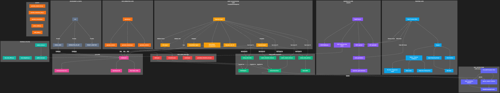
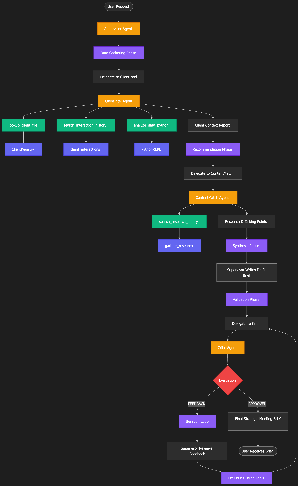
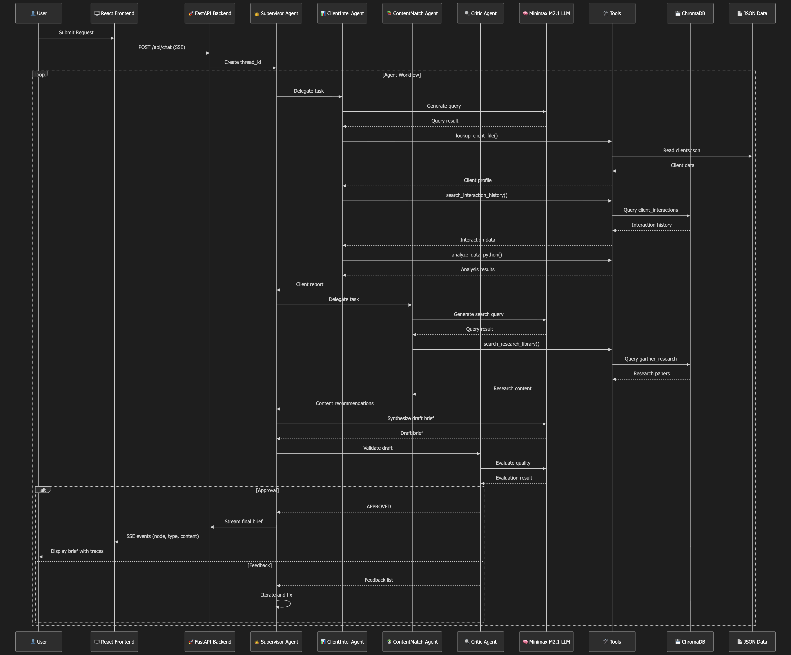
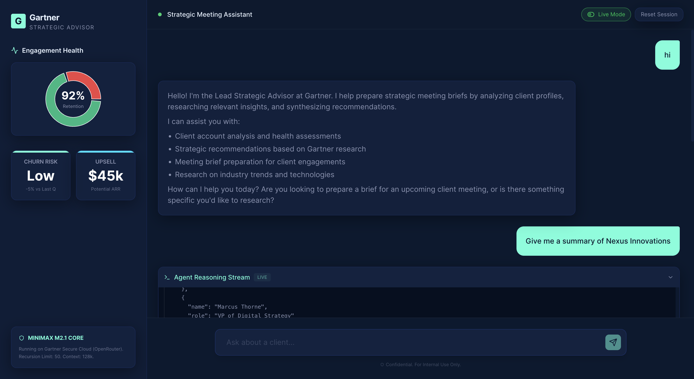

<div align="center">

# StartBrief - Multi-Agent Intelligence System

### AI-Powered Strategic Meeting Briefs for Frontline Associates

[](https://www.python.org/)
[](https://reactjs.org/)
[](https://fastapi.tiangolo.com/)
[](https://github.com/langchain-ai/langgraph)

*Transforming client intelligence into actionable strategic briefs through coordinated multi-agent orchestration*

</div>

---

## Overview

StartBrief is an intelligent multi-agent system that transforms raw client data into comprehensive strategic meeting briefs. By orchestrating specialized AI agents, it delivers actionable insights for frontline associates, enabling data-driven client engagements.

## Key Features

* **Multi-Agent Orchestration** - 4 specialized agents working in coordination
* **Real-Time Client Intelligence** - Analyzes engagement metrics, contracts, and interaction history
* **RAG-Powered Research Matching** - Semantic search across research library
* **Quality Assurance Loop** - Built-in critic agent for output validation
* **Streaming Response Interface** - Live agent reasoning traces with SSE
* **Comprehensive Data Suite** - 100+ clients, 6-month metric history, associate performance

## System Architecture



## Agent Flow



## Data Flow



## User Interface



## Agent Workflow

1. **Data Gathering** - ClientIntel agent analyzes account health, metrics, contracts, and history
2. **Content Matching** - ContentMatch agent retrieves relevant research via semantic search
3. **Synthesis** - Supervisor agent drafts comprehensive strategic brief
4. **Validation** - Critic agent evaluates quality and approves or requests iteration
5. **Delivery** - Final brief streamed with full reasoning trace

## Tech Stack

| Layer | Technology |
|-------|-----------|
| **Frontend** | React 18, Vite, Tailwind CSS, Framer Motion |
| **Backend** | FastAPI, LangGraph, LangChain |
| **LLM** | GLM-4.7 via ZAI API (Anthropic-compatible) |
| **Vector DB** | ChromaDB with persistent storage |
| **Data** | JSON-based mock data generation |

## Quick Start

### Prerequisites

```bash
Python 3.11+
Node.js 18+
```

### Installation

1. Clone the repository:
```bash
git clone <repo-url>
cd gartner
```

2. Set up Python environment:
```bash
python -m venv .venv
source .venv/bin/activate  # Windows: .venv\Scripts\activate
pip install -r requirements.txt
```

3. Configure environment:
```bash
cp .env.example .env
# Edit .env with your ZAI_API_KEY
```

4. Set up frontend:
```bash
cd gss_agent/frontend
npm install
```

5. Start the backend:
```bash
# From root directory
python -m gss_agent.api.main
```

6. Start the frontend (new terminal):
```bash
cd gss_agent/frontend
npm run dev
```

7. Access the application:
```
Frontend: http://localhost:5173
Backend API: http://localhost:8000
API Docs: http://localhost:8000/docs
```

## Usage

### Basic Request

```
Prepare a strategic brief for TechCorp Inc.
Focus on their recent engagement decline and
identify relevant research on digital transformation.
```

### API Endpoint

```bash
curl -X POST http://localhost:8000/api/chat \
  -H "Content-Type: application/json" \
  -d '{"message": "Prepare brief for TechCorp Inc."}'
```

## Project Structure

```
gss_agent/
├── api/
│   └── main.py              # FastAPI server with SSE streaming
├── core/
│   ├── agents.py            # 4 agent definitions
│   └── tools.py             # LangChain tools
├── data/
│   ├── clients.json         # 100+ client profiles
│   ├── contracts.json       # Contract/ARR details
│   ├── associates.json      # Associate profiles
│   ├── associate_performance.json  # KPI metrics
│   ├── client_metrics_timeseries.json  # 6-month history
│   ├── interactions.json    # Interaction history
│   └── content.json         # Research library
├── frontend/
│   └── src/
│       └── App.jsx          # React interface
├── rag/
│   └── vector_store.py      # ChromaDB integration
└── scripts/
    ├── generate_*.py        # Data generation scripts
    └── ingest_data.py       # Data ingestion pipeline
```

## Agents

### Supervisor Agent
Orchestrates the workflow, synthesizes briefs, manages iteration loop

### ClientIntel Agent
Analyzes client profiles, engagement metrics, contracts, interaction history

### ContentMatch Agent
Performs semantic search across research library for relevant content

### Critic Agent
Validates output quality, checks for hallucinations, ensures professional tone

## Tools

- `lookup_client_file` - Retrieve client profiles
- `get_client_engagement_metrics` - Get 6-month metric history
- `lookup_contract_details` - Access contract/ARR information
- `get_associate_performance_context` - Associate performance data
- `search_interaction_history` - Search past interactions
- `search_research_library` - RAG-powered research search
- `analyze_data_python` - Python code execution for analysis

## Environment Variables

```bash
ZAI_API_KEY=your_api_key_here
ZAI_BASE_URL=https://api.z.ai/api/anthropic
MODEL_NAME=glm-4.7
MAX_TOKENS=8000
RECURSION_LIMIT=100
```

## Data Generation

Generate comprehensive mock data:

```bash
# From root directory
python scripts/generate_clients_detailed.py
python scripts/generate_contracts.py
python scripts/generate_associates.py
python scripts/generate_interactions_detailed.py
python scripts/generate_metrics_timeseries.py
python scripts/generate_research_detailed.py

# Ingest all data
python scripts/ingest_data.py
```

## Development

### Running Tests

```bash
# Test individual components
python scripts/test_tools_offline.py
python scripts/test_integration.py
```

### Monitoring

Agent traces and reasoning steps are logged in real-time through the SSE stream, accessible in the frontend trace panel.

## License

Proprietary - Internal Use Only

---

<div align="center">

Built with intelligence for intelligence

[Report Issue](../../issues) · [Request Feature](../../issues)

</div>
