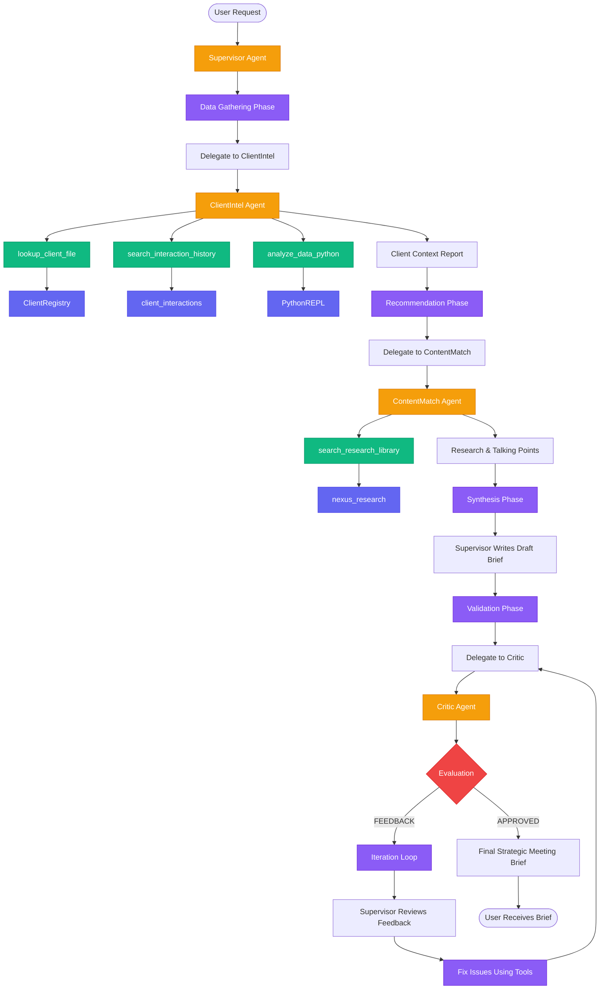
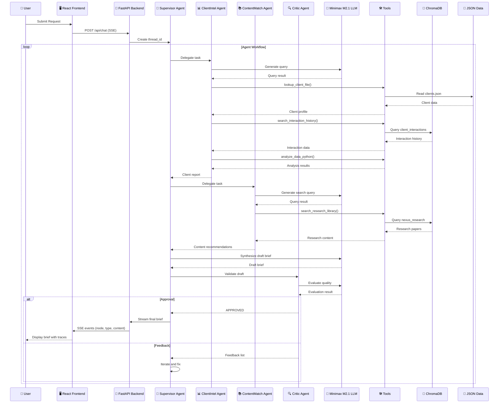

# Nexus Strategic Advisor Multi-Agent System - Architecture Diagram

## System Overview

This document provides a comprehensive Mermaid diagram showcasing the entire architecture of the Nexus Strategic Advisor multi-agent system, including frontend, backend, data layer, agents, tools, and the complete data flow.

---

## Complete System Architecture

```mermaid
graph TB
    subgraph "FRONTEND LAYER"
        ReactApp["React Frontend (Vite)"]
        ReactApp --> App["App.jsx"]
        App --> ChatInterface["Chat Interface"]
        App --> TraceLog["Agent Reasoning Stream"]
        App --> Sidebar["Sidebar / Business Intelligence"]
        
        Sidebar --> PieChart["Pie Chart: Engagement Health"]
        Sidebar --> Metrics["Metric Cards"]
        Sidebar --> ModelInfo["Model Info: Minimax M2.1"]
        
        ChatInterface --> SSEClient["SSE Client"]
        TraceLog --> SSEClient
    end



    subgraph "BACKEND API LAYER (FastAPI)"
        FastAPI["FastAPI Server"]
        FastAPI --> CORS["CORS Middleware"]
        FastAPI --> ChatEndpoint["POST /api/chat"]
        FastAPI --> MockEndpoint["POST /api/mock-chat-golden"]
        FastAPI --> HealthEndpoint["GET /api/health"]
        
        ChatEndpoint --> EventGenerator["event_generator()"]
        EventGenerator --> SupervisorStream["supervisor_agent.astream()"]
    end

    subgraph "AGENT ORCHESTRATION LAYER (LangGraph/DeepAgents)"
        SupervisorAgent["Supervisor Agent"]
        ClientIntelAgent["ClientIntel Agent"]
        ContentMatchAgent["ContentMatch Agent"]
        CriticAgent["Critic Agent"]
        
        SupervisorAgent --> MemorySaver["MemorySaver (Checkpointer)"]
        SupervisorAgent --> RecursionLimit["Recursion Limit: 50"]
        
        SupervisorAgent -.->|Delegates| ClientIntelAgent
        SupervisorAgent -.->|Delegates| ContentMatchAgent
        SupervisorAgent -.->|Validates with| CriticAgent
    end

    subgraph "TOOLS LAYER (LangChain)"
        LookupClient["lookup_client_file()"]
        SearchResearch["search_research_library()"]
        SearchInteractions["search_interaction_history()"]
        AnalyzeData["analyze_data_python()"]
        
        LookupClient --> ClientRegistry["ClientRegistry"]
        SearchResearch --> VectorStore["Nexus AdvisoryVectorStore"]
        SearchInteractions --> VectorStore
        AnalyzeData --> PythonREPL["PythonREPL"]
    end

    subgraph "RAG / VECTOR STORE LAYER (ChromaDB)"
        ChromaDB["ChromaDB Persistent Client"]
        ChromaDB --> ResearchCollection["nexus_research Collection"]
        ChromaDB --> InteractionCollection["client_interactions Collection"]
        
        ResearchCollection --> EmbeddingFn["DefaultEmbeddingFunction"]
        InteractionCollection --> EmbeddingFn
    end

    subgraph "DATA LAYER (JSON Files)"
        ClientsJSON["clients.json"]
        ContentJSON["content.json"]
        InteractionsJSON["interactions.json"]
        GeneratedInteractionsJSON["generated_interactions_llm.json"]
        
        ClientsJSON -->|Ingested via| ClientRegistry
        ContentJSON -->|Ingested via| VectorStore
        InteractionsJSON -->|Ingested via| VectorStore
    end

    subgraph "DATA GENERATION LAYER"
        Generator["generator.py"]
        Generator --> GenerateClients["generate_clients()"]
        Generator --> GenerateContent["generate_content()"]
        Generator --> GenerateInteractions["generate_interactions()"]
        
        GenerateClients --> ClientsJSON
        GenerateContent --> ContentJSON
        GenerateInteractions --> InteractionsJSON
    end

    subgraph "LLM LAYER"
        LLM["ChatOpenAI"]
        LLM --> MinimaxModel["minimax/minimax-m2.1"]
        LLM --> OpenRouterAPI["OpenRouter API"]
        LLM --> MaxTokens["Max Tokens: 4000"]
    end

    subgraph "ENVIRONMENT & CONFIG"
        EnvFile[".env"]
        EnvFile -->|Provides| OpenRouterAPIKey["OPENROUTER_API_KEY"]
        EnvFile -->|Provides| ModelName["MODEL_NAME"]
        EnvFile -->|Provides| PersistDir["PERSIST_DIRECTORY"]
    end

    subgraph "TESTING & UTILITIES"
        TestToolsOffline["test_tools_offline.py"]
        TestIntegration["test_integration.py"]
        CaptureTrace["capture_trace.py"]
        GoldenTrace["golden_trace.json"]
        
        CaptureTrace --> GoldenTrace
        MockEndpoint --> GoldenTrace
    end

    subgraph "SCRIPTS"
        GenerateResearchLLM["generate_research_llm.py"]
        GenerateInteractionsLLM["generate_interactions_llm.py"]
        GenerateTranscripts["generate_transcripts.py"]
        ProbeModels["probe_models.py"]
        VerifyData["verify_data.py"]
    end

    %% Connections
    ReactApp -->|SSE Stream| ChatEndpoint
    
    ChatEndpoint -->|Streams Events| ReactApp
    EventGenerator -->|Yields SSE Events| ReactApp
    
    SupervisorAgent -->|Uses| LLM
    ClientIntelAgent -->|Uses| LLM
    ContentMatchAgent -->|Uses| LLM
    CriticAgent -->|Uses| LLM
    
    SupervisorAgent -->|Has Access To| LookupClient
    SupervisorAgent -->|Has Access To| SearchResearch
    SupervisorAgent -->|Has Access To| SearchInteractions
    SupervisorAgent -->|Has Access To| AnalyzeData
    
    ClientIntelAgent -->|Has Access To| LookupClient
    ClientIntelAgent -->|Has Access To| SearchInteractions
    ClientIntelAgent -->|Has Access To| AnalyzeData
    
    ContentMatchAgent -->|Has Access To| SearchResearch
    
    CriticAgent -->|Validates Output| SupervisorAgent
    
    VectorStore -->|Queries| ResearchCollection
    VectorStore -->|Queries| InteractionCollection
    
    OpenRouterAPIKey -->|Configures| LLM
    ModelName -->|Configures| LLM
    
    %% Styling
    classDef frontend fill:#0ea5e9,stroke:#0369a1,color:#fff
    classDef backend fill:#8b5cf6,stroke:#6d28d9,color:#fff
    classDef agent fill:#f59e0b,stroke:#d97706,color:#fff
    classDef tools fill:#10b981,stroke:#059669,color:#fff
    classDef data fill:#ef4444,stroke:#dc2626,color:#fff
    classDef llm fill:#ec4899,stroke:#db2777,color:#fff
    classDef storage fill:#6366f1,stroke:#4f46e5,color:#fff
    classDef config fill:#64748b,stroke:#475569,color:#fff
    classDef test fill:#14b8a6,stroke:#0d9488,color:#fff
    classDef script fill:#f97316,stroke:#ea580c,color:#fff
    
    class ReactApp,App,ChatInterface,TraceLog,Sidebar,PieChart,Metrics,ModelInfo,SSEClient frontend
    class FastAPI,CORS,ChatEndpoint,MockEndpoint,HealthEndpoint,EventGenerator,SupervisorStream backend
    class SupervisorAgent,ClientIntelAgent,ContentMatchAgent,CriticAgent,MemorySaver,RecursionLimit agent
    class LookupClient,SearchResearch,SearchInteractions,AnalyzeData,ClientRegistry,VectorStore,PythonREPL tools
    class ClientsJSON,ContentJSON,InteractionsJSON,GeneratedInteractionsJSON data
    class ChromaDB,ResearchCollection,InteractionCollection,EmbeddingFn storage
    class Generator,GenerateClients,GenerateContent,GenerateInteractions script
    class LLM,MinimaxModel,OpenRouterAPI,MaxTokens llm
    class EnvFile,OpenRouterAPIKey,ModelName,PersistDir config
    class TestToolsOffline,TestIntegration,CaptureTrace,GoldenTrace test
    class GenerateResearchLLM,GenerateInteractionsLLM,GenerateTranscripts,ProbeModels,VerifyData script
```



---

## Agent Workflow Flowchart



---

## Data Flow Diagram



---

## Component Details

### Frontend Layer
- **React App** ([`App.jsx`](gss_agent/frontend/src/App.jsx:1)): Main React application with Vite
  - Chat interface with streaming SSE responses
  - Trace log showing agent reasoning steps
  - Sidebar with business intelligence metrics
  - Live/Mock mode toggle

### Backend API Layer
- **FastAPI** ([`main.py`](gss_agent/api/main.py:1)): REST API server
  - `/api/chat`: Main chat endpoint with SSE streaming
  - `/api/mock-chat-golden`: Mock endpoint for testing
  - `/api/health`: Health check endpoint

### Agent Orchestration Layer
- **Supervisor Agent** ([`agents.py`](gss_agent/core/agents.py:92)): Orchestrates the workflow
- **ClientIntel Agent** ([`agents.py`](gss_agent/core/agents.py:25)): Analyzes client profiles and risks
- **ContentMatch Agent** ([`agents.py`](gss_agent/core/agents.py:40)): Matches research to client needs
- **Critic Agent** ([`agents.py`](gss_agent/core/agents.py:54)): Validates output quality

### Tools Layer
- **lookup_client_file** ([`tools.py`](gss_agent/core/tools.py:25)): Retrieves client profiles
- **search_research_library** ([`tools.py`](gss_agent/core/tools.py:36)): Searches Nexus Advisory research
- **search_interaction_history** ([`tools.py`](gss_agent/core/tools.py:46)): Searches client interactions
- **analyze_data_python** ([`tools.py`](gss_agent/core/tools.py:62)): Executes Python for analysis

### RAG/Vector Store Layer
- **ChromaDB** ([`vector_store.py`](gss_agent/rag/vector_store.py:1)): Persistent vector database
  - `nexus_research` collection
  - `client_interactions` collection

### Data Layer
- **clients.json** ([`clients.json`](gss_agent/data/clients.json:1)): Client profiles with industry, revenue, churn risk
- **content.json** ([`content.json`](gss_agent/data/content.json:1)): Nexus Advisory research papers
- **interactions.json** ([`interactions.json`](gss_agent/data/interactions.json:1)): Client interaction history

### LLM Layer
- **Minimax M2.1** ([`agents.py`](gss_agent/core/agents.py:12)): Primary LLM model via OpenRouter
  - Max tokens: 4000
  - Context: 128k

### System Prompts

#### Supervisor Agent Prompt
```
You are the Lead Strategic Advisor at Nexus Advisory. 
Goal: Produce a "Strategic Meeting Brief" that wows both the associate and the client.

Operational Workflow:
1. DATA GATHERING: Delegate to 'ClientIntel' to get the full picture of the account.
2. RECOMMENDATION: Delegate to 'ContentMatch' to find high-impact research (2024/2025).
3. SYNTHESIS: Write a professional Markdown brief. Structure: 'Executive Summary', 'Client Health', 'Strategic Recommendations', 'Talking Points'.
4. VALIDATION: Pass your draft to the 'Critic'. 
5. ITERATION: If the Critic provides feedback, use your tools again if necessary to fix the issues.
6. COMPLETION: Once the Critic says "APPROVED", provide the final brief to the user.

Constraint: Avoid redundancy. If information is already in the 'ClientIntel' report, don't repeat it unless synthesizing value.
```

#### ClientIntel Agent Prompt
```
You are a Nexus Advisory Client Intelligence Expert.
Objective: Provide a deep-dive analysis of the client's current status and churn risk.
Inputs: You have access to client registry and interaction history.
Instructions:
- Use 'lookup_client_file' to understand the client's industry, revenue, and entitlements (e.g., GSL, GSSO).
- Use 'search_interaction_history' to find recent high-stakes conversations or negative sentiment.
- If usage data is present in interactions, use 'analyze_data_python' to calculate growth/drop trends.
- Output a structured summary: 'Client Context', 'Engagement Health', and 'Identified Risks'.
```

#### ContentMatch Agent Prompt
```
You are a Nexus Advisory Content Strategy Expert.
Objective: Find the most impactful Nexus Advisory research to drive value for the client.
Instructions:
- Use 'search_research_library' with specific keywords derived from the client's industry or current pain points.
- Prioritize 2024/2025 Magic Quadrants and Hype Cycles.
- For each piece of research, provide a 'Talking Point' tailored to their main contact role (CIO, CSO, etc.).
- Explicitly state 'Why this matters' in the context of their specific business goals.
```

#### Critic Agent Prompt
```
You are the Nexus Advisory Quality Assurance Critic.
Objective: Ensure the "Strategic Meeting Brief" is world-class and hallucination-free.
Rubric:
1. RELEVANCE: Does it use the specific client industry and revenue data?
2. ACCURACY: Are the research titles exact matches to what was retrieved? (Hallucination is a fail).
3. ACTIONABILITY: Are there at least 3 concrete conversation starters?
4. TONE: Does it sound like a premium Nexus Advisory advisor? (Blue-chip, strategic, concise).

Feedback Loop:
- If the brief passes all criteria, respond ONLY with "APPROVED".
- If it fails, provide a bulleted list of fixes for the Supervisor.
```

---

## File Structure

```
gss_agent/
├── api/
│   └── main.py                    # FastAPI backend server
├── core/
│   ├── agents.py                  # Agent definitions (4 agents)
│   └── tools.py                  # LangChain tools (4 tools)
├── data/
│   ├── clients.json               # Client profiles
│   ├── content.json              # Nexus Advisory research
│   ├── interactions.json          # Client interactions
│   ├── generated_interactions_llm.json
│   └── generator.py             # Data generation script
├── frontend/
│   ├── src/
│   │   ├── App.jsx              # React main app
│   │   ├── main.jsx             # Entry point
│   │   └── index.css            # Styles
│   └── package.json             # React dependencies
├── rag/
│   └── vector_store.py          # ChromaDB integration
├── monitoring/
│   └── __init__.py
├── __init__.py
chroma_db/                       # ChromaDB persistent storage
.env                             # Environment variables
```

---

## Key Technologies

| Layer | Technology |
|-------|-----------|
| Frontend | React, Vite, Tailwind CSS, Framer Motion, Recharts, ReactMarkdown |
| Backend | FastAPI, LangGraph, LangChain, LangChain OpenAI |
| LLM | Minimax M2.1 via OpenRouter API |
| Vector DB | ChromaDB with DefaultEmbeddingFunction |
| Data Storage | JSON files |
| Python Runtime | Python 3.x |
